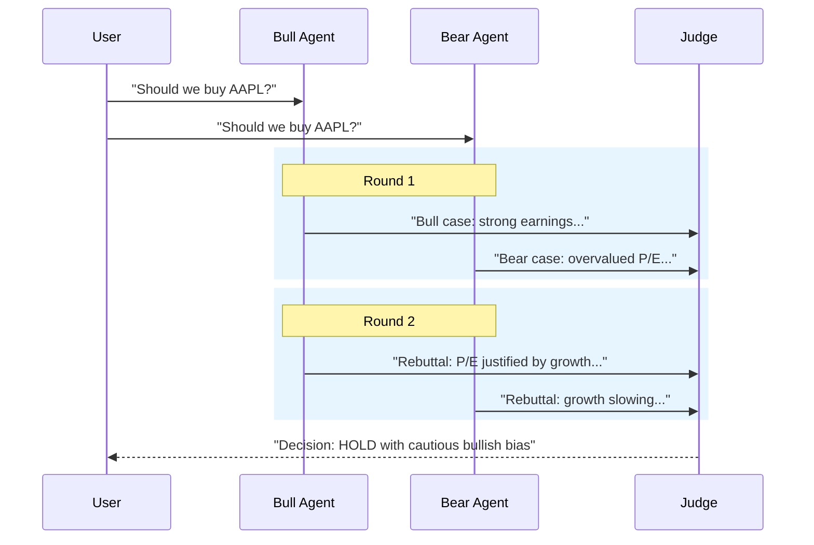

# Debate Pattern

Multiple agents argue positions over rounds, with a judge rendering a final decision.

## Sequence Diagram



## Code Example

```python
import asyncio
from pyagent_patterns.base import Agent, MockLLM
from pyagent_patterns.resolution import Debate

debate = Debate(
    debaters=[
        Agent("bull", MockLLM(responses=["Strong earnings growth justifies premium", "Growth trajectory intact"])),
        Agent("bear", MockLLM(responses=["P/E ratio unsustainably high", "Competition intensifying"])),
    ],
    judge=Agent("judge", MockLLM(responses=["Decision: HOLD — valid points on both sides"])),
    rounds=2,
    positions=["BUY", "SELL"],
)

result = asyncio.run(debate.run("Should we buy AAPL at current prices?"))
print(result.output)
print(f"Rounds: {result.metadata['rounds']}, Arguments: {len(result.metadata['debate_log'])}")
```

## When to Use

- ✅ **Use when:** Decision requires examining opposing viewpoints
- ✅ **Use when:** Stakes are high and you want adversarial testing
- ❌ **Avoid when:** Budget is tight (many LLM calls)
- ❌ **Avoid when:** Answer is factual, not debatable
