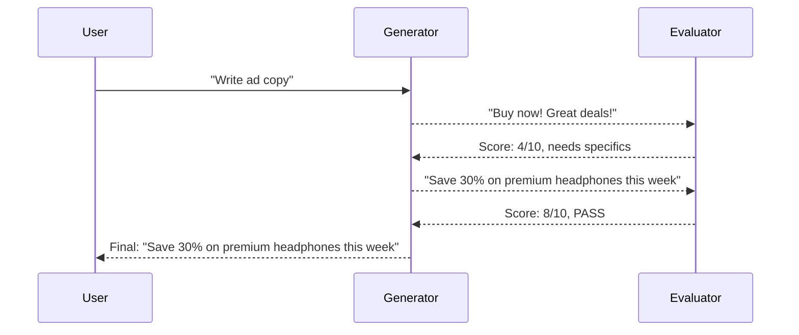

# Evaluator-Optimizer Pattern

Generator produces output, evaluator scores against criteria, loop until threshold met.

## Sequence Diagram



## Code Example

```python
import asyncio
from pyagent_patterns.base import Agent, MockLLM
from pyagent_patterns.resolution import EvaluatorOptimizer

pattern = EvaluatorOptimizer(
    generator=Agent("copywriter", MockLLM(responses=["Buy now!", "Save 30% on headphones this week"])),
    evaluator=Agent("critic", MockLLM(responses=[
        "SCORE: 4\nFEEDBACK: Too generic, add specifics",
        "SCORE: 8\nFEEDBACK: Much better, specific and compelling",
    ])),
    pass_threshold=7,
    max_rounds=3,
)

result = asyncio.run(pattern.run("Write compelling ad copy for wireless headphones"))
print(f"Score: {result.metadata['final_score']}, Rounds: {result.metadata['rounds']}")
```

## When to Use

- ✅ **Use when:** You have explicit quality criteria (score 1-10)
- ✅ **Use when:** Iterative improvement is worthwhile
- ❌ **Avoid when:** Quality is subjective
