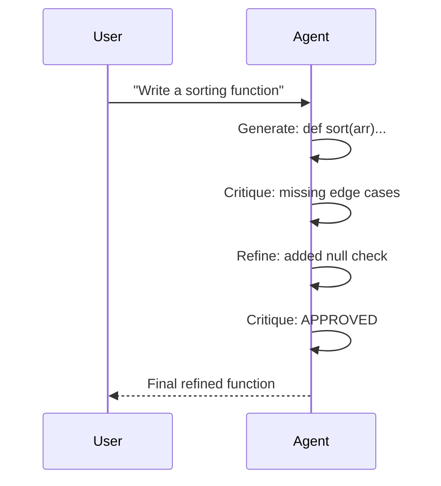

# Self-Reflection Pattern

An agent generates output, critiques its own work, and refines iteratively.

## Sequence Diagram



## Code Example

```python
import asyncio
from pyagent_patterns.base import Agent, MockLLM
from pyagent_patterns.resolution import SelfReflection

llm = MockLLM(responses=[
    "def sort(arr): return sorted(arr)",
    "Missing: null check, empty array handling",
    "def sort(arr):\n    if not arr: return []\n    return sorted(arr)",
    "APPROVED - handles edge cases",
])

pattern = SelfReflection(agent=Agent("coder", llm), max_rounds=3)
result = asyncio.run(pattern.run("Write a robust sorting function"))
print(result.output)
print(f"Rounds: {result.metadata['rounds']}, Early stop: {result.metadata['early_stop']}")
```

## When to Use

- ✅ **Use when:** Single agent can meaningfully self-critique
- ✅ **Use when:** Task has clear quality criteria (code correctness, grammar)
- ❌ **Avoid when:** Agent lacks domain expertise to self-evaluate
- ❌ **Avoid when:** External perspective needed (use Cross-Reflection)
