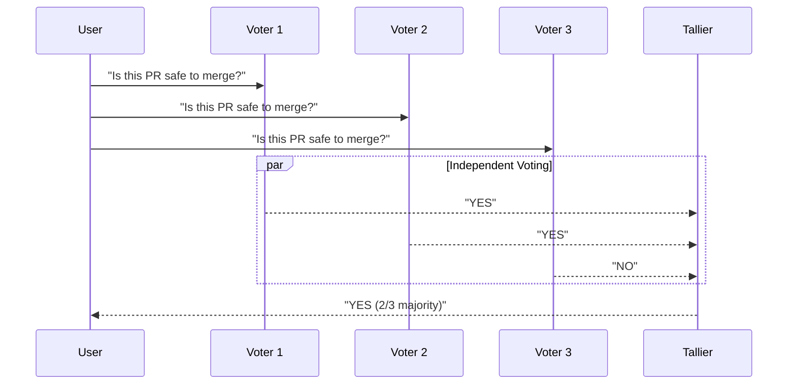

# Voting Pattern

N agents vote independently, majority wins. Supports weighted voting.

## Sequence Diagram



## Code Example

```python
import asyncio
from pyagent_patterns.base import Agent, MockLLM
from pyagent_patterns.resolution import Voting

pattern = Voting(
    voters=[
        Agent("security", MockLLM(responses=["YES\nNo vulnerabilities found"])),
        Agent("style", MockLLM(responses=["YES\nFollows coding standards"])),
        Agent("perf", MockLLM(responses=["NO\nPotential N+1 query issue"])),
    ],
    strategy="majority",
)

result = asyncio.run(pattern.run("Is this PR safe to merge?"))
print(f"Decision: {result.metadata['winner']} (Tally: {result.metadata['tally']})")
```

## When to Use

- ✅ **Use when:** You need fault tolerance (single agent failure doesn't break result)
- ✅ **Use when:** Task has a clear discrete answer (yes/no, A/B/C)
- ❌ **Avoid when:** Task requires nuanced, open-ended output
