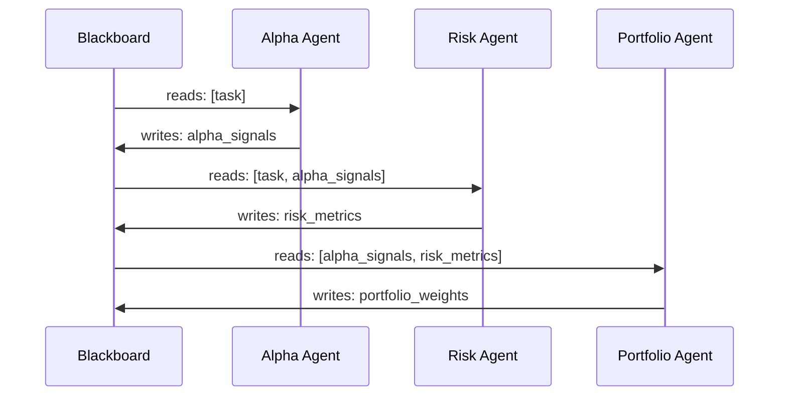

# Blackboard Pattern

Agents communicate indirectly via a shared, asynchronous data store.

## Sequence Diagram



## Code Example

```python
import asyncio
from pyagent_patterns.base import Agent, MockLLM
from pyagent_patterns.structural import Blackboard
from pyagent_patterns.structural.blackboard import BlackboardAgent

pattern = Blackboard(
    agents=[
        BlackboardAgent(
            agent=Agent("alpha", MockLLM(responses=["alpha_signals: AAPL bullish, MSFT neutral"])),
            reads=["task"],
            writes=["alpha_signals"],
        ),
        BlackboardAgent(
            agent=Agent("risk", MockLLM(responses=["risk_metrics: portfolio VaR 2.3%"])),
            reads=["task", "alpha_signals"],
            writes=["risk_metrics"],
        ),
        BlackboardAgent(
            agent=Agent("portfolio", MockLLM(responses=["portfolio_weights: AAPL 40%, MSFT 30%, cash 30%"])),
            reads=["alpha_signals", "risk_metrics"],
            writes=["portfolio_weights"],
        ),
    ],
    rounds=1,
)

result = asyncio.run(pattern.run("Construct optimal portfolio"))
print(result.metadata["final_state"])
```
