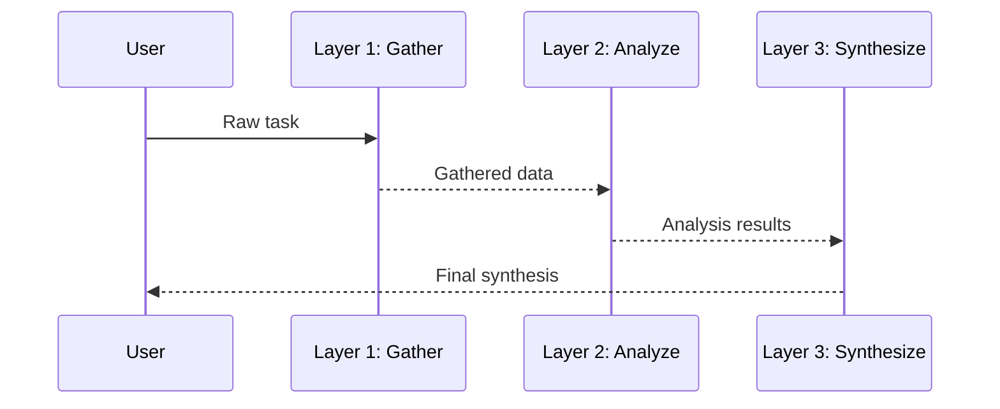

# Layered Cooperation

Agents organized into hierarchical abstraction layers, each processing the previous layer's output.

## Sequence Diagram



## Code Example

```python
import asyncio
from pyagent_patterns.base import Agent, MockLLM
from pyagent_patterns.structural import Layered
from pyagent_patterns.structural.layered import Layer

llm = MockLLM(responses=["Raw data gathered", "Analyzed patterns", "Executive summary"])
pattern = Layered(layers=[
    Layer(name="gather", agents=[Agent("scraper", llm)]),
    Layer(name="analyze", agents=[Agent("analyst", llm)]),
    Layer(name="synthesize", agents=[Agent("exec", llm)]),
])

result = asyncio.run(pattern.run("Analyze competitive landscape"))
```
