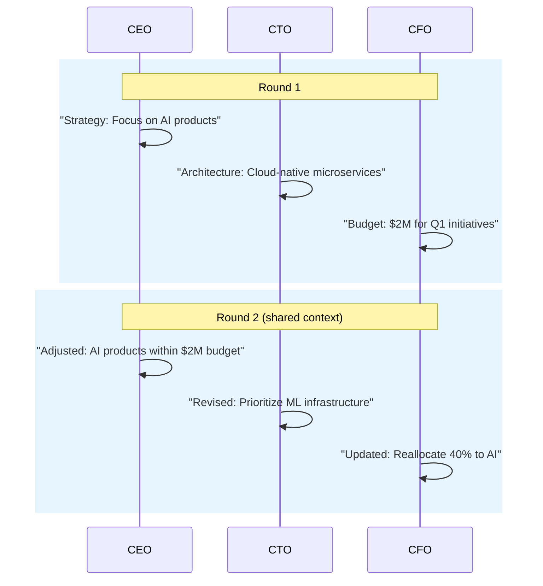

# Role-Based Cooperation

Agents with distinct roles collaborate in structured rounds.

## Sequence Diagram



## Code Example

```python
import asyncio
from pyagent_patterns.base import Agent, MockLLM
from pyagent_patterns.structural import RoleBased

pattern = RoleBased(
    agents=[
        Agent("CEO", MockLLM(responses=["Strategy: focus on AI"]), system_prompt="You are the CEO"),
        Agent("CTO", MockLLM(responses=["Architecture: cloud-native"]), system_prompt="You are the CTO"),
        Agent("CFO", MockLLM(responses=["Budget: $2M Q1"]), system_prompt="You are the CFO"),
    ],
    rounds=2,
    shared_context=True,
)

result = asyncio.run(pattern.run("Plan our product strategy for Q1"))
```
