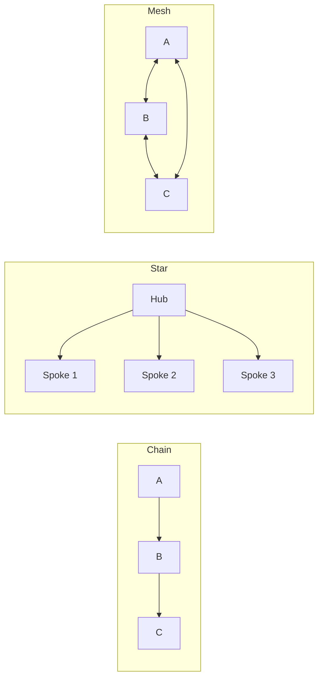

# Topology Pattern

Configure agent communication as Chain, Star, or Mesh graphs.

## Topology Types



## Code Example

```python
import asyncio
from pyagent_patterns.base import Agent, MockLLM
from pyagent_patterns.structural import Topology, TopologyType

llm = MockLLM(responses=["Output A", "Output B", "Output C"])

# Chain topology
chain = Topology(
    agents=[Agent("A", llm), Agent("B", llm), Agent("C", llm)],
    topology=TopologyType.CHAIN,
)

# Star topology (Hub + Spokes)
star = Topology(
    agents=[Agent("Hub", llm), Agent("S1", llm), Agent("S2", llm)],
    topology=TopologyType.STAR,
    hub_index=0,
)

result = asyncio.run(chain.run("Process data through the chain"))
```
