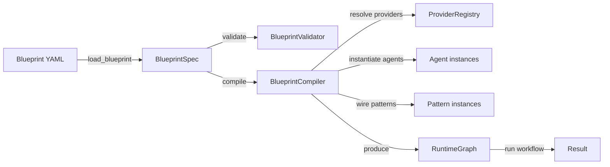

# pyagent-blueprint

**Pillar 1 of the PyAgent spec-driven architecture for orchestrating multi-agent systems** — declare your entire agent system in a single YAML file. Validate, compile, test, diff, and generate from the CLI.

[](../../LICENSE)
[](https://www.python.org/downloads/)

> **Architecture Pillar: 📋 Blueprint**
> The entry point for all PyAgent systems — declare agents, workflows, providers, and contracts in a single YAML file, then validate, compile, and test without writing Python.
> Part of the full stack: install `pyagent-all` for all pillars.

## Install

```bash
# Core: schema, validation, rendering, diffing — zero runtime dependency
pip install pyagent-blueprint

# + the bundled PyAgent reference runtime (pyagent-patterns/router/providers/context)
pip install "pyagent-blueprint[pyagent]"
```

Core depends only on `pydantic`, `pyyaml`, `click`. Executing a compiled
blueprint requires a `RuntimeAdapter` — either the bundled `[pyagent]`
extra, one of four zero-dependency reference adapters shipped in-repo
(`single_agent`, `sequential_chain`, `state_machine`, `simple_loop`), or a
third-party adapter for LangGraph / CrewAI / AutoGen / Semantic Kernel /
OpenAI Agents SDK / your own runtime. See
[Adapters & Framework-Agnostic Runtimes](#adapters--framework-agnostic-runtimes) below.

| Install | Adapters available |
|---|---|
| `pip install pyagent-blueprint` | `single_agent`, `sequential_chain`, `state_machine`, `simple_loop` (zero extra deps) |
| `pip install "pyagent-blueprint[pyagent]"` | + `pyagent` (full PyAgent pattern registry: pipeline, supervisor, debate, voting, fan-out/fan-in, etc.) |
| + third-party adapter package | + whatever that package registers (e.g. `langgraph`, `crewai`) |

## Why Blueprints?

Without blueprints, agent systems are defined in code — hard to version, diff, review, or test without running them. With `pyagent-blueprint`, your agent system is a **YAML document** that is:
- **Versioned**: semantic version + git-diffable
- **Validated**: Pydantic schema + static analysis (dangling refs, security)
- **Compiled**: YAML → executable RuntimeGraph in one call
- **Testable**: contract conformance tests with MockLLM
- **Renderable**: Mermaid diagrams + Markdown docs auto-generated

## Blueprint YAML Schema

```yaml
api_version: pyagent/v1
metadata:
  name: customer-support
  version: 1.0.0
  description: Support routing system
  owner: platform-team

providers:
  primary:
    model: gpt-4.1-mini
  fallback:
    model: gpt-4.1-nano

context:
  memory:
    working_max_tokens: 128000
  compression:
    policy: semantic_lossless
    target_ratio: 0.6

agents:
  classifier:
    prompt: "Classify into: billing, tech, general"
    provider: primary
  billing:
    prompt: "Handle billing inquiries"
    provider: primary
    guardrails: [pii_redact]
  tech:
    prompt: "Handle technical support"
    provider: primary

workflows:
  support:
    pattern: supervisor
    agents:
      classifier: classifier
      routes:
        billing: billing
        tech: tech
    recovery:
      max_retries: 2
      timeout_seconds: 30

contracts:
  support:
    input:
      type: string
      max_tokens: 2000
    output:
      type: string
    sla:
      latency_p95_ms: 5000
      cost_max_usd: 0.05

observability:
  tracing:
    enabled: true
  cost_budget:
    daily_usd: 100.0
    alert_threshold: 0.8
```

## Loader — Load and Validate

```python
from pyagent_blueprint import load_blueprint, load_blueprint_from_str

# From file
spec = load_blueprint("blueprint.yaml")  # YAML or JSON
print(spec.metadata.name)  # "customer-support"
print(spec.agents.keys())  # dict_keys(['classifier', 'billing', 'tech'])

# From string
spec = load_blueprint_from_str(yaml_text)
```

## Compiler — Spec → RuntimeGraph

```python
import asyncio
from pyagent_blueprint import BlueprintCompiler, load_blueprint

spec = load_blueprint("blueprint.yaml")
compiler = BlueprintCompiler()
graph = compiler.compile(spec)

# Run a workflow
result = asyncio.run(graph.run("support", "I can't see my invoice"))
print(result.output)

# Inspect
print(graph.describe())
# {"metadata": {...}, "workflows": {"support": {"pattern_type": "Supervisor"}}}
```

## Validator — Static Analysis

```python
from pyagent_blueprint import BlueprintValidator, load_blueprint

spec = load_blueprint("blueprint.yaml")
validator = BlueprintValidator()
issues = validator.validate(spec)

for issue in issues:
    print(f"[{issue.severity}] {issue.path}: {issue.message}")
```

**Checks performed:**
- Dangling agent refs (workflow references undefined agent)
- Dangling provider refs (agent references undefined provider)
- Unknown pattern names (not in pattern registry)
- Contract → workflow ref mismatch
- Unrealistic SLA values
- Security: hardcoded API keys in prompts

## Renderer — Mermaid + Markdown

```python
from pyagent_blueprint import BlueprintRenderer, load_blueprint

spec = load_blueprint("blueprint.yaml")
renderer = BlueprintRenderer()

# Mermaid diagram
print(renderer.to_mermaid(spec))
# graph TD
#     classifier[Routes customer requests]
#     billing[Billing specialist]
#     tech[Technical support agent]
#     classifier -->|billing| billing
#     classifier -->|tech| tech

# Full Markdown documentation
md = renderer.to_markdown(spec)
```

## Differ — Semantic Diff

```python
from pyagent_blueprint import BlueprintDiffer, load_blueprint

old = load_blueprint("v1.yaml")
new = load_blueprint("v2.yaml")

differ = BlueprintDiffer()
changes = differ.diff(old, new)

print(differ.summary(changes))
# BREAKING (1):
#   [modified] workflows.support.pattern
# WARNING (2):
#   [modified] agents.billing.prompt
#   [removed] agents.legacy
```

Severity levels:
- **BREAKING**: pattern changes, API version changes
- **WARNING**: prompt changes, provider changes, removals
- **INFO**: metadata, descriptions, additions

## Tester — Contract Conformance

```python
import asyncio
from pyagent_blueprint import BlueprintTester, load_blueprint

spec = load_blueprint("blueprint.yaml")
tester = BlueprintTester()

results = asyncio.run(tester.test(spec))
print(tester.summary(results))
# Contract Tests: 1/1 passed
#   ✓ PASS  support
#          ✓ output_non_empty
#          ✓ output_is_string
#          ✓ input_within_token_limit
```

## Generator — Scaffold from Pattern

```python
from pyagent_blueprint import BlueprintGenerator

generator = BlueprintGenerator()
yaml_str = generator.generate(
    pattern="supervisor",
    agents=["classifier", "billing", "tech"],
    name="customer-support",
)
print(yaml_str)
```

## CLI Reference

```bash
# Validate
pyagent-blueprint validate blueprint.yaml

# Compile and inspect
pyagent-blueprint compile blueprint.yaml

# Render Mermaid diagram
pyagent-blueprint render blueprint.yaml
pyagent-blueprint render blueprint.yaml --format markdown -o docs.md

# Run contract tests
pyagent-blueprint test blueprint.yaml

# Semantic diff
pyagent-blueprint diff v1.yaml v2.yaml

# Generate scaffold
pyagent-blueprint generate --pattern supervisor --agents "classifier,billing,tech" --name my-system

# List discoverable RuntimeAdapters and their capabilities
pyagent-blueprint adapters

# Package a blueprint into a distributable "Agent Unit" archive
# (requires a top-level `package:` block — see below)
pyagent-blueprint package blueprint.yaml -o dist/

# Scaffold a starter RuntimeAdapter package for a third-party SDK
pyagent-blueprint adapter-template --framework LangGraph -o ./my-langgraph-adapter
```

## Adapters & Framework-Agnostic Runtimes

A blueprint compiles to a framework-agnostic `BlueprintIR`, then a
`RuntimeAdapter` translates that IR into something a specific agent SDK
can execute. Core never imports any agent-execution framework — adapters
are the only place `pyagent_patterns`, `langgraph`, `crewai`, etc. may be
imported, and they're discovered via Python entry points
(`pyagent_blueprint.adapters`).

```python
from pyagent_blueprint.adapter import AdapterRegistry

adapters = AdapterRegistry.discover()  # {"single_agent": ..., "pyagent": ..., ...}
adapter = AdapterRegistry.get("single_agent")()
artifact = adapter.compile(ir)  # CompiledArtifact(handle, diagnostics, intent)
result = await adapter.run(artifact, "support", "my question")
```

Four zero-dependency reference adapters ship in-repo and pass a shared
`AdapterConformanceSuite` — the proof that the `RuntimeAdapter` contract
isn't shaped around any one framework:

| Adapter | Model | Capability exercised |
|---|---|---|
| `single_agent` | Degenerate no-orchestration case | `SYNC_EXECUTION` |
| `sequential_chain` | Strict linear pipeline | (none — baseline) |
| `state_machine` | Explicit FSM | `PARTIAL_WORKFLOW_RUN` |
| `simple_loop` | Bare while-loop | `STREAMING` |
| `pyagent` | Full pattern registry (pipeline, supervisor, debate, voting, ...) | `PARTIAL_WORKFLOW_RUN` |

### Writing your own adapter

Run the scaffold command to generate a starter package with the entry
point pre-wired and the conformance suite already imported:

```bash
pyagent-blueprint adapter-template --framework CrewAI -o ./my-crewai-adapter
cd my-crewai-adapter
pip install -e .[test]
# fill in src/pyagent_blueprint_adapter_crewai/adapter.py
pytest tests/
```

Passing `AdapterConformanceSuite` (from `pyagent_blueprint.conformance`)
is the acceptance bar for any adapter — in-repo or third-party.

## Packaging — "Agent Unit" Artifacts

Add an optional top-level `package:` block to declare distribution metadata:

```yaml
package:
  name: research-agent-unit
  version: 1.0.0
  author: platform-team
  runtime: single_agent   # must match a discoverable RuntimeAdapter
  dependencies: []
```

Then build a distributable archive:

```bash
pyagent-blueprint package blueprint.yaml -o dist/
# → dist/research-agent-unit-1.0.0.agentunit.zip
#   containing unit.json (manifest + content hash) + the original spec
```


## Observability Configuration — Tracing & Cost Budgets

The `observability` section of a blueprint declares tracing and cost budget settings. These are validated by the schema and compiled into configuration objects that consumers wire at runtime.

```yaml
observability:
  tracing:
    enabled: true          # Enable trace event emission
    exporter: langfuse     # Preferred exporter backend (console, jsonl, otel, langfuse)
  cost_budget:
    daily_usd: 100.0       # Daily cost ceiling in USD
    alert_threshold: 0.8   # Alert when 80% of budget consumed
```

**Schema classes** (defined in `pyagent_blueprint.schema.observability`):

| Class | Fields | Description |
|-------|--------|-------------|
| `TracingConfig` | `enabled`, `exporter` | Whether tracing is active and which exporter to use |
| `CostBudgetConfig` | `daily_usd`, `alert_threshold` | Daily cost limits and alert thresholds |
| `ObservabilitySpec` | `tracing`, `cost_budget` | Top-level observability container |

After compilation, these settings are available on the `RuntimeGraph` but are **not automatically wired** — consumers must manually set up the `TraceEventBus` and exporters. The compiler will emit warnings if `observability` is declared but the consumer has not wired tracing hooks.

## Context Configuration — Memory, Compression & Redaction

The `context` section declares memory, compression, and redaction settings for agents:

```yaml
context:
  memory:
    backend: sqlite             # json or sqlite
    working_max_tokens: 128000  # WorkingMemory token limit
    session_path: session.db    # SessionMemory persistence path
  compression:
    policy: semantic_lossless   # none, fifo, semantic_lossless, sawtooth
    target_ratio: 0.6           # Target compression ratio (0.0–1.0)
  redaction:
    max_sensitivity: internal   # Filter out PII and confidential items
```

**Schema classes** (defined in `pyagent_blueprint.schema.context`):

| Class | Fields | Description |
|-------|--------|-------------|
| `MemoryConfig` | `backend`, `working_max_tokens`, `session_path` | Memory tier configuration |
| `CompressionConfig` | `policy`, `target_ratio` | Context compression policy and target |
| `RedactionConfig` | `max_sensitivity` | Sensitivity ceiling for LLM-bound context |
| `ContextConfigSpec` | `memory`, `compression`, `redaction` | Top-level context container |

Like observability, context configuration is compiled but **manually wired** by the consumer. The compiler warns if context settings are declared but not connected to agents.

## RuntimeGraph — The Compiled Output

`BlueprintCompiler.compile()` produces a `RuntimeGraph` containing:

- **Resolved providers** — `ProviderProtocol` instances from the `ProviderRegistry`
- **Instantiated agents** — `Agent` objects with LLM callables, system prompts, and metadata
- **Wired workflows** — Named patterns (`Pipeline`, `Supervisor`, etc.) assembled from agents
- **Metadata** — Blueprint name, version, description for traceability

```python
graph = compiler.compile(spec)

# Run a named workflow
result = await graph.run("support", "I can't see my invoice")

# Inspect the graph structure
print(graph.describe())
# {
#     "metadata": {"name": "customer-support", "version": "1.0.0"},
#     "workflows": {
#         "support": {
#             "pattern_type": "Supervisor",
#             "agents": ["classifier", "billing", "tech"],
#         }
#     },
#     "providers": ["primary", "fallback"],
#     "observability": {"tracing": {"enabled": true}},
#     "context": {"compression": {"policy": "semantic_lossless"}},
# }
```

## Compiler Warnings

The `BlueprintCompiler` performs static analysis during compilation and emits warnings for common misconfigurations:

| Warning | Trigger | Severity |
|---------|---------|----------|
| Dangling agent ref | Workflow references an undefined agent | ERROR |
| Dangling provider ref | Agent references an undefined provider | ERROR |
| Unknown pattern | Workflow uses a pattern not in the registry | ERROR |
| Unwired observability | `observability.tracing.enabled: true` but no `TraceEventBus` wired | WARNING |
| Unwired context | `context.memory` or `context.compression` declared but not connected | WARNING |
| Unrealistic SLA | Contract SLA values outside reasonable bounds | WARNING |
| Hardcoded secrets | API keys detected in agent prompts | WARNING |

Warnings for unwired observability and context are especially important: they alert consumers that configuration was **declared** in the blueprint but was never **connected** at runtime. This helps catch integration oversights without breaking backward compatibility.

## Integration

Blueprint is the integration hub of the PyAgent ecosystem:

| Dependency | How It's Used |
|------------|--------------|
| **pyagent-patterns** | Pattern registry for workflow compilation (18 built-in patterns + custom) |
| **pyagent-router** | `CostEstimator` and `DifficultyScorer` for routing-aware blueprints |
| **pyagent-providers** | `ProviderRegistry` for resolving named providers to `ProviderProtocol` instances |
| **pyagent-context** | `ContextConfigSpec` drives memory, compression, and redaction configuration |
| **pyagent-trace** | `ObservabilitySpec` configures tracing and cost budgets (wired manually) |
| **pyagent-studio** | Studio loads, validates, and simulates blueprints through its service layer |

### The Blueprint → Runtime Flow



1. **Load** — `load_blueprint("file.yaml")` parses YAML and produces a `BlueprintSpec` (Pydantic model)
2. **Validate** — `BlueprintValidator.validate(spec)` runs static checks (dangling refs, security, SLA)
3. **Compile** — `BlueprintCompiler.compile(spec)` resolves providers, instantiates agents, wires patterns
4. **Wire hooks** — Consumer manually connects `TraceEventBus`, `ContextLedger`, `CompressMiddleware` to agents
5. **Run** — `graph.run("workflow_name", "input")` executes the pattern and returns a `Result`

## Full stack

Install all pillars at once: `pip install pyagent-all`

→ [pyagent.org](https://pyagent.org) for full documentation.

## Full Documentation

See [pyagent.org](https://pyagent.org) for full API reference and integration guides.

<!-- pyagent-ecosystem-footer:start -->

## The PyAgent ecosystem

PyAgent is a spec-driven architecture for orchestrating multi-agent systems. Each package is independent — install
only what you need, or get everything with [`pip install pyagent-all`](https://pyagent.org/getting-started/).

| Package | What it gives you |
|---------|-------------------|
| `pyagent-blueprint` | [Declarative multi-agent blueprints](https://pyagent.org/guides/blueprint/) — compile, validate, and diff agent systems from YAML |
| `pyagent-patterns` | [Reusable multi-agent design patterns](https://pyagent.org/packages/patterns/) — Supervisor, Pipeline, ReAct, and 15 more |
| `pyagent-router` | [Difficulty-aware model routing](https://pyagent.org/guides/router/) — cost-efficient model selection per task |
| `pyagent-compress` | [Token-efficient agent compression](https://pyagent.org/guides/compression/) — inter-agent token budgets |
| `pyagent-providers` | [Multi-provider orchestration](https://pyagent.org/guides/providers/) — fallback chains and capability negotiation |
| `pyagent-context` | [Stateful agent memory](https://pyagent.org/guides/context/) — trust-aware, three-tier context ledger |
| `pyagent-trace` | [Multi-agent observability & tracing](https://pyagent.org/guides/tracing/) — pattern-aware OpenTelemetry spans |
| `pyagent-studio` | [Agent control plane dashboard](https://pyagent.org/guides/studio/) — live traces, cost, and governance |

**Learn more:**
[Design patterns](https://pyagent.org/packages/patterns/) ·
[Cookbook](https://pyagent.org/cookbook/) ·
[Get started](https://pyagent.org/getting-started/)

<!-- pyagent-ecosystem-footer:end -->
