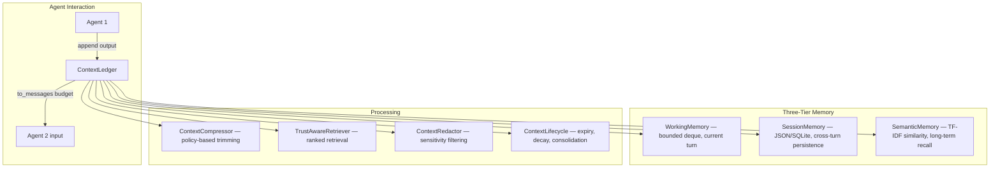

# pyagent-context

**Three-tier memory with trust-aware context ledger** for multi-agent LLM systems. Structured context management with trust levels, sensitivity classification, compression policies, and lifecycle management.

[](../../LICENSE)
[](https://www.python.org/downloads/)

## Install

```bash
pip install pyagent-context                   # Core (working + session + semantic memory)
pip install pyagent-context[compress]         # + ContextCompressor with pyagent-compress
pip install pyagent-context[chromadb]         # + ChromaDB semantic memory backend
```

Depends on: `pyagent-patterns`.

## Why Structured Context?

Without `pyagent-context`, multi-agent workflows pass a flat `list[Message]` that grows unbounded. You lose track of *who* said *what*, *when*, and *how much to trust it*. This package adds trust levels, sensitivity tiers, expiry, compression, and three memory tiers — so your agents always work with the right context.

## ContextItem — Everything Has Metadata

```python
import time
from pyagent_context import ContextItem, TrustLevel, Sensitivity

item = ContextItem(
    content="Revenue grew 15% YoY to $25.2B",
    source="analyst",
    trust_level=TrustLevel.VERIFIED,       # verified | inferred | user | external
    sensitivity=Sensitivity.INTERNAL,       # public | internal | confidential | restricted
    expires_at=time.time() + 3600,         # auto-expire in 1 hour
    derived_from="abc123",                  # parent item ID
)

print(item.id)               # unique 12-char hex
print(item.token_estimate)   # auto-calculated: len(content) // 4
print(item.is_expired)       # False (still within TTL)
print(item.age_seconds)      # seconds since creation

# Serialize / deserialize
data = item.to_dict()
restored = ContextItem.from_dict(data)
```

## ContextLedger — Append-Only Context Log

```python
from pyagent_context import ContextLedger, TrustLevel

ledger = ContextLedger()

# Add items
ledger.add("User asked about Q3 earnings", "user", TrustLevel.USER_PROVIDED)
ledger.add("Revenue: $25.2B (+8% YoY)", "analyst", TrustLevel.VERIFIED)
ledger.add("I think margins will improve", "forecaster", TrustLevel.INFERRED)

# Query by trust
verified = ledger.query(min_trust=TrustLevel.VERIFIED)
print(len(verified))  # 1

# Query by age (last 5 minutes)
recent = ledger.query(max_age_seconds=300)

# Query by source
from_analyst = ledger.query(source="analyst")

# Convert to Messages for pattern consumption
messages = ledger.to_messages()              # all items
messages = ledger.to_messages(max_tokens=500)  # budget-constrained (most recent first)

# Snapshot for persistence
snap = ledger.snapshot()                     # JSON-serializable dict
restored = ContextLedger.from_snapshot(snap)
```

## Three-Tier Memory

### WorkingMemory — Bounded In-Flight Context

```python
from pyagent_context import WorkingMemory, ContextItem

wm = WorkingMemory(max_items=50, max_tokens=10_000)

item = ContextItem(content="New observation", source="agent_1")
evicted = wm.add(item)  # returns list of evicted items if capacity exceeded

print(len(wm))            # current item count
print(wm.total_tokens)    # current token usage
print(f"{wm.utilization:.0%}")  # e.g. "42%"
```

### SessionMemory — Persist Across Turns

```python
from pyagent_context import SessionMemory, ContextItem

# JSON backend (simple, human-readable)
session = SessionMemory("user-123-session", backend="json", storage_path=".sessions")
session.add(ContextItem(content="User prefers concise answers", source="user"))
session.save()

# Later: reload
session2 = SessionMemory("user-123-session", backend="json", storage_path=".sessions")
session2.load()
items = session2.get_all()

# SQLite backend (concurrent-safe)
session = SessionMemory("user-123-session", backend="sqlite", storage_path=".sessions")
session.add(ContextItem(content="Important context", source="system"))
session.save()
```

### SemanticMemory — Vector-Indexed Long-Term Store

```python
from pyagent_context import InMemorySemanticStore, ContextItem

store = InMemorySemanticStore()

# Index items
store.add(ContextItem(content="Python asyncio event loop concurrency patterns", source="docs"))
store.add(ContextItem(content="JavaScript React component lifecycle hooks", source="docs"))
store.add(ContextItem(content="Python FastAPI async web framework REST API design", source="docs"))

# Semantic search (TF-IDF cosine similarity)
results = store.search("Python async web", top_k=3)
for r in results:
    print(f"  [{r.score:.2f}] {r.item.content[:60]}...")

# Remove / clear
store.remove(item_id)
store.clear()
```

## ContextCompressor — Manage Token Growth

Four policies: `NONE`, `FIFO`, `SEMANTIC_LOSSLESS`, `SAWTOOTH`.

```python
from pyagent_context import ContextCompressor, CompressionPolicy, ContextLedger

# FIFO: drop oldest items until under floor
compressor = ContextCompressor(
    policy=CompressionPolicy.FIFO,
    threshold_tokens=10_000,   # trigger compression at 10k tokens
    floor_tokens=5_000,        # compress down to 5k
)

if compressor.should_compress(ledger):
    compressed = compressor.compress(ledger)
    print(f"Compressed: {ledger.total_tokens} → {compressed.total_tokens} tokens")

# SAWTOOTH: compress to floor, then allow growth again
compressor = ContextCompressor(
    policy=CompressionPolicy.SAWTOOTH,
    threshold_tokens=10_000,
    floor_tokens=3_000,
)

# SEMANTIC_LOSSLESS: compress text but preserve verified items unchanged
compressor = ContextCompressor(
    policy=CompressionPolicy.SEMANTIC_LOSSLESS,
    threshold_tokens=8_000,
    floor_tokens=4_000,
)
```

## TrustAwareRetriever — Smart Context Selection

Scores items by `trust × recency × relevance`:

```python
from pyagent_context import TrustAwareRetriever

retriever = TrustAwareRetriever(
    weight_trust=0.3,
    weight_recency=0.3,
    weight_relevance=0.4,
    recency_half_life=3600.0,   # 1 hour half-life
)

results = retriever.retrieve(ledger, "Q3 earnings revenue growth", top_k=5)
for r in results:
    print(f"  [{r.score:.2f}] trust={r.trust_score:.2f} "
          f"recency={r.recency_score:.2f} relevance={r.relevance_score:.2f}")
    print(f"    {r.item.content[:80]}...")
```

## ContextLifecycle — Expiry, Decay, Consolidation

```python
from pyagent_context import ContextLifecycle

lifecycle = ContextLifecycle(consolidation_threshold=0.6)

# Remove expired items
new_ledger, expired = lifecycle.sweep_expired(ledger)
print(f"Removed {len(expired)} expired items")

# Apply freshness decay (old items get smaller token budgets)
decayed = lifecycle.apply_freshness_decay(ledger, half_life_seconds=3600)

# Merge similar items from the same source
consolidated = lifecycle.consolidate(ledger)
print(f"Consolidated: {len(ledger)} → {len(consolidated)} items")
```

## ContextRedactor — Sensitivity-Based Redaction

```python
from pyagent_context import ContextRedactor
from pyagent_context.item import Sensitivity

# Redact items above INTERNAL sensitivity
redactor = ContextRedactor(
    max_sensitivity=Sensitivity.INTERNAL,
    redaction_text="[REDACTED — CONFIDENTIAL]",
)

redacted_ledger = redactor.redact_ledger(ledger)

# Or exclude entirely instead of redacting
redactor = ContextRedactor(
    max_sensitivity=Sensitivity.INTERNAL,
    exclude_above=True,
)
filtered_ledger = redactor.redact_ledger(ledger)
```

## Integration with pyagent-patterns

```python
from pyagent_patterns.base import Agent, MockLLM
from pyagent_patterns.orchestration import Pipeline
from pyagent_context import ContextLedger, TrustLevel, WorkingMemory

ledger = ContextLedger()

# Before pattern run: seed with trusted context
ledger.add("User is asking about Q3 2025 earnings", "user", TrustLevel.USER_PROVIDED)
ledger.add("Tesla Q3 revenue was $25.2B", "database", TrustLevel.VERIFIED)

# Convert to messages and prepend to pattern input
context_messages = ledger.to_messages(max_tokens=2000)

# After pattern run: store results
ledger.add(result.output, "pipeline", TrustLevel.INFERRED)
```

## Architecture — Three-Tier Memory Model



### Memory Tier Details

| Tier | Class | Storage | Capacity | Eviction | Use Case |
|------|-------|---------|----------|----------|----------|
| **Working** | `WorkingMemory` | In-memory deque | `max_items` or `max_tokens` | Oldest-first when full | Current conversation turn |
| **Session** | `SessionMemory` | JSON file or SQLite | Unlimited | Manual clear | Cross-turn persistence (multi-step workflows) |
| **Semantic** | `InMemorySemanticStore` | In-memory TF-IDF index | Unlimited | Manual | Long-term recall via similarity search |

### WorkingMemory Eviction

When `WorkingMemory` reaches its `max_items` or `max_tokens` limit, the oldest items are evicted first. Utilization metrics are available:

```python
from pyagent_context import WorkingMemory

wm = WorkingMemory(max_items=20, max_tokens=8000)
wm.add(item)

print(wm.utilization)     # 0.05 → 5% of max_items used
print(wm.token_usage)     # current token estimate total
print(len(wm))            # number of items in memory
wm.clear()                # flush all items
```

### SessionMemory Backends

```python
from pyagent_context import SessionMemory

# JSON backend — simple file-based persistence
sm_json = SessionMemory(backend="json", path="session.json")

# SQLite backend — more robust, concurrent-safe
sm_sqlite = SessionMemory(backend="sqlite", path="session.db")

sm_json.add(item)
sm_json.save()            # persist to disk
sm_json.load()            # reload from disk
items = sm_json.retrieve(query="billing", top_k=5)
```

### SemanticMemory — TF-IDF Similarity Search

The `InMemorySemanticStore` uses TF-IDF vectorization for similarity-based retrieval across the full context history:

```python
from pyagent_context import InMemorySemanticStore

store = InMemorySemanticStore()
store.add(item1)
store.add(item2)
store.add(item3)

# Retrieve items most similar to the query
results = store.search("billing question", top_k=3)
for item, score in results:
    print(f"[{score:.2f}] {item.content[:80]}...")
```

## ContextLedger — Token-Budgeted Message Conversion

The `ContextLedger` is an append-only log that converts stored `ContextItem` objects into LLM-compatible messages with automatic token budgeting:

```python
from pyagent_context import ContextLedger, ContextItem, TrustLevel

ledger = ContextLedger()
ledger.append(ContextItem(content="Revenue was $25.2B", source="database", trust=TrustLevel.VERIFIED))
ledger.append(ContextItem(content="Margin expanded to 17%", source="agent_1", trust=TrustLevel.INFERRED))

# Convert to messages with a token budget
# Higher-trust items are prioritized when budget is tight
messages = ledger.to_messages(budget=4000)
print(ledger.total_tokens())  # total token estimate across all items
```

## TrustAwareRetriever — Composite Scoring

The retriever ranks items using a composite score of three signals:

| Signal | Weight | Description |
|--------|--------|-------------|
| **Trust** | Configurable | `VERIFIED` > `INFERRED` > `USER_PROVIDED` > `UNVERIFIED` |
| **Recency** | Half-life decay | Newer items score higher; decay rate is configurable |
| **Relevance** | Keyword overlap | TF-IDF similarity between query and item content |

```python
from pyagent_context import TrustAwareRetriever

retriever = TrustAwareRetriever(
    trust_weight=0.4,
    recency_weight=0.3,
    relevance_weight=0.3,
    half_life_hours=24.0,
)
results = retriever.retrieve(items, query="billing issue", top_k=5)
```

## Integration with pyagent-patterns

Context flows between agents via the `ContextLedger`:

```python
from pyagent_patterns.base import Agent, MockLLM
from pyagent_patterns.orchestration import Pipeline
from pyagent_context import ContextLedger, ContextItem, TrustLevel

ledger = ContextLedger()

# Before agent execution: read context to prepend as system/user messages
context_messages = ledger.to_messages(budget=4000)

# After agent execution: write output as a new context item
ledger.append(ContextItem(
    content=result.output,
    source="analyst",
    trust=TrustLevel.INFERRED,
))
```

In the hook-based integration model, agents automatically read from and write to the ledger when one is attached via `set_context()`.

## Integration with pyagent-compress

Two levels of compression work together:

| Layer | Package | What It Compresses | How |
|-------|---------|-------------------|-----|
| **Message-level** | `pyagent-compress` | Individual agent outputs | Extractive: remove filler, rank sentences, keep top-N |
| **Context-level** | `pyagent-context` | Accumulated context items | Policy-based: FIFO, semantic lossless, sawtooth |

```python
from pyagent_context import ContextCompressor, ContextLedger
from pyagent_compress import MessageCompressor

# Context compression: decide which items to keep
compressor = ContextCompressor(policy="semantic_lossless")
trimmed = compressor.compress(ledger.items(), target_tokens=4000)

# Message compression: reduce verbosity of individual outputs
msg_compressor = MessageCompressor(target_ratio=0.5)
compressed = msg_compressor.compress(agent_output)
```

## Integration with pyagent-trace

Context operations can be tracked via the `TraceEventBus`:

- **Ledger writes** — When agents append items, trace events capture the source, trust level, and token count
- **Memory tier transitions** — Working → session → semantic migrations emit trace events
- **Retrieval** — Trust-aware retrieval results (scores, items selected) are logged for debugging
- **Compression** — Context compression events show which items were kept/dropped and the token savings

## Integration with pyagent-blueprint

The `context` section of a blueprint YAML maps directly to context package configuration:

```yaml
context:
  memory:
    backend: sqlite
    working_max_tokens: 128000
  compression:
    policy: semantic_lossless
    target_ratio: 0.6
  redaction:
    max_sensitivity: internal
```

After `BlueprintCompiler.compile()`, these settings are available on the `RuntimeGraph` for the consumer to wire into agents.

## Full Documentation

See [pyagent.org](https://pyagent.org) for full API reference and integration guides.
