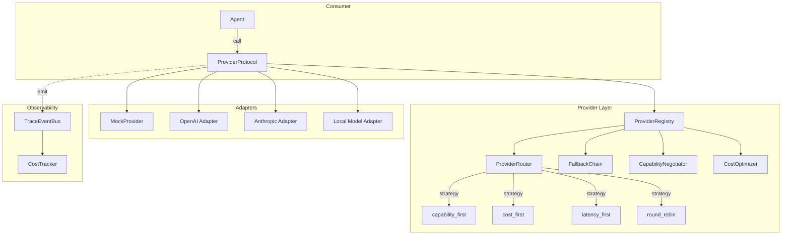

# pyagent-providers

**Pillar 2 of the PyAgent production stack for multi-agent LLM systems** — multi-provider abstraction with capability negotiation, health checks, fallback chains, and cost-optimized routing.

[](../../LICENSE)
[](https://www.python.org/downloads/)

> **Architecture Pillar: ⚡ Execution**
> Abstracts LLM provider backends behind a single `ProviderProtocol` — registry, routing strategies, fallback chains, capability negotiation, and cost optimisation for the Execution pillar.
> Part of the full stack: install `pyagent-all` for all pillars.

## Install

```bash
pip install pyagent-providers                  # Core (includes MockProvider)
pip install pyagent-providers[openai]          # + OpenAI adapter
pip install pyagent-providers[anthropic]       # + Anthropic adapter
pip install pyagent-providers[litellm]         # + LiteLLM (100+ models)
pip install pyagent-providers[all]             # All adapters
```

Depends on: `pyagent-patterns`, `pyagent-router`.

## Why Provider Abstraction?

Without `pyagent-providers`, switching models means rewriting LLM wrappers. With it, your agents talk to a `ProviderProtocol` that satisfies the existing `LLMCallable` interface — so every provider is a drop-in replacement for `Agent.llm`.

```python
from pyagent_patterns.base import Agent
from pyagent_providers.adapters.mock import MockProvider

# Any provider works as an Agent's LLM
provider = MockProvider(name="test", responses=["Hello"])
agent = Agent("greeter", provider)  # provider satisfies LLMCallable
```

## ProviderProtocol — The Interface

Every provider implements this:

```python
from pyagent_providers import ProviderProtocol, HealthStatus, ProviderCapabilities

class MyCustomProvider:
    @property
    def name(self) -> str:
        return "my_provider"

    @property
    def capabilities(self) -> ProviderCapabilities:
        return ProviderCapabilities(
            models=["my-model-small", "my-model-large"],
            capabilities={Capability.GENERAL, Capability.CODE},
            max_context=128_000,
            supports_streaming=True,
        )

    async def health(self) -> HealthStatus:
        # check your endpoint
        return HealthStatus.HEALTHY

    async def complete(self, messages, model=None) -> str:
        # call your API
        return "response"

    async def __call__(self, messages) -> str:
        return await self.complete(messages)
```

## ProviderRegistry — Register and Discover

```python
import asyncio
from pyagent_providers import ProviderRegistry, HealthStatus
from pyagent_providers.adapters.mock import MockProvider
from pyagent_router.selector import Capability

registry = ProviderRegistry()

async def setup():
    await registry.register(MockProvider(
        name="openai",
        models=["gpt-4o-mini", "gpt-4o"],
        capabilities={Capability.GENERAL, Capability.CODE, Capability.VISION},
    ))
    await registry.register(MockProvider(
        name="anthropic",
        models=["claude-haiku-3.5", "claude-sonnet-4"],
        capabilities={Capability.GENERAL, Capability.CODE, Capability.CREATIVE},
    ))

    # Discover by capability
    coders = registry.discover({Capability.CODE})
    print([p.name for p in coders])  # ["openai", "anthropic"]

    vision = registry.discover({Capability.VISION})
    print([p.name for p in vision])  # ["openai"]

    # Health check all
    statuses = await registry.check_health()
    print(statuses)  # {"openai": "healthy", "anthropic": "healthy"}

    # Remove unhealthy
    removed = await registry.remove_unhealthy()
    print(f"Removed: {removed}")  # []

asyncio.run(setup())
```

## ProviderRouter — Strategy-Based Routing

Four strategies: `CAPABILITY_FIRST`, `COST_FIRST`, `LATENCY_FIRST`, `ROUND_ROBIN`.

```python
from pyagent_providers import ProviderRouter, RoutingStrategy
from pyagent_patterns.base import Message

# Capability-first (default): pick the provider with broadest capabilities
router = ProviderRouter(registry, strategy=RoutingStrategy.CAPABILITY_FIRST)
provider, model = asyncio.run(router.route(
    [Message.user("Write a Python REST API with FastAPI")],
    required={Capability.CODE},
))
print(f"{provider.name}/{model}")

# Cost-first: cheapest provider + model for the task
router = ProviderRouter(registry, strategy=RoutingStrategy.COST_FIRST)
provider, model = asyncio.run(router.route([Message.user("What is 2+2?")]))
print(f"{provider.name}/{model}")  # picks gpt-4.1-nano

# Round-robin: cycle through providers for load distribution
router = ProviderRouter(registry, strategy=RoutingStrategy.ROUND_ROBIN)
for _ in range(4):
    provider, model = asyncio.run(router.route([Message.user("Balance me")]))
    print(provider.name, end=" ")
# openai anthropic openai anthropic
```

## FallbackChain — Resilient Completion

Try providers in order. If one fails, fall through to the next. Optionally integrates with `CircuitBreaker` from `pyagent-patterns`.

```python
from pyagent_providers import FallbackChain

chain = FallbackChain(providers=[
    primary_openai,      # try first
    fallback_anthropic,  # if OpenAI fails
    emergency_litellm,   # last resort
])

result = asyncio.run(chain.complete([Message.user("Important task")]))
print(result.output)           # response from first successful provider
print(result.provider_name)    # which provider answered
print(result.attempts)         # full attempt log with errors

# With circuit breaker integration
from pyagent_patterns.recovery import CircuitBreaker

chain = FallbackChain(
    providers=[primary, fallback],
    circuit_breakers={
        "primary": CircuitBreaker(failure_threshold=3, reset_timeout_seconds=60),
    },
)
```

## CapabilityNegotiator — Match Task Requirements

Scores providers by capability overlap, context window, and feature support.

```python
from pyagent_providers import CapabilityNegotiator

negotiator = CapabilityNegotiator(registry)

# Find best provider for code + reasoning tasks
result = negotiator.negotiate(
    required_capabilities={Capability.CODE, Capability.REASONING},
    min_context=100_000,
)
if result:
    print(result.provider.name)         # "openai" or "anthropic"
    print(result.model)                 # best model from that provider
    print(f"Match: {result.match_score:.0%}")
    print(result.matched_capabilities)  # {CODE, REASONING}
    print(result.missing_capabilities)  # set()

# Get all ranked matches
all_matches = negotiator.negotiate_all(
    required_capabilities={Capability.GENERAL},
    limit=5,
)
for m in all_matches:
    print(f"  {m.provider.name}: {m.match_score:.0%}")
```

## CostOptimizer — Multi-Provider Cost Comparison

```python
from pyagent_providers import CostOptimizer

optimizer = CostOptimizer(registry)

# Compare all providers for a task
estimates = optimizer.compare("Explain distributed consensus algorithms")
for est in estimates[:5]:
    print(f"{est.provider_name}/{est.model}: ${est.estimate.total_cost:.7f}")

# Get cheapest option
cheapest = optimizer.cheapest("Simple greeting task")
if cheapest:
    print(f"Use {cheapest.provider_name}/{cheapest.model}: ${cheapest.estimate.total_cost:.7f}")

# Get provider object + model for direct use
pair = optimizer.cheapest_provider("My task")
if pair:
    provider, model = pair
    agent = Agent("my_agent", provider)
```

## Adapter Examples

### OpenAI

```python
from pyagent_providers.adapters.openai import OpenAIProvider

openai = OpenAIProvider(
    api_key="sk-...",            # or set OPENAI_API_KEY env var
    default_model="gpt-4o-mini",
    models=["gpt-4o-mini", "gpt-4o", "o3-mini"],
)

await registry.register(openai)
result = await openai.complete([Message.user("Hello")])
```

### Anthropic

```python
from pyagent_providers.adapters.anthropic import AnthropicProvider

anthropic = AnthropicProvider(
    api_key="sk-ant-...",
    default_model="claude-sonnet-4-20250514",
)

await registry.register(anthropic)
result = await anthropic.complete([Message.user("Hello")])
```

### LiteLLM (100+ Providers)

```python
from pyagent_providers.adapters.litellm import LiteLLMProvider

litellm = LiteLLMProvider(
    models=["gpt-4o-mini", "anthropic/claude-haiku-3.5", "gemini/gemini-2.5-flash"],
    default_model="gpt-4o-mini",
)

await registry.register(litellm)
result = await litellm.complete([Message.user("Hello")], model="gemini/gemini-2.5-flash")
```

### MockProvider (Testing)

```python
from pyagent_providers.adapters.mock import MockProvider

mock = MockProvider(
    name="test",
    responses=["Response 1", "Response 2"],
    models=["mock-fast", "mock-smart"],
    capabilities={Capability.GENERAL, Capability.CODE},
    health_status=HealthStatus.HEALTHY,
)

await registry.register(mock)
result = await mock.complete([Message.user("Test")])
print(mock.call_count)  # 1
```

## Integration with pyagent-patterns

```python
from pyagent_patterns.base import Agent
from pyagent_patterns.orchestration import Pipeline
from pyagent_providers import ProviderRegistry, CapabilityNegotiator
from pyagent_providers.adapters.mock import MockProvider

# Set up providers
registry = ProviderRegistry()
registry.register_sync(MockProvider(name="fast", responses=["Extracted facts"]))
registry.register_sync(MockProvider(name="smart", responses=["Detailed analysis"]))

# Use providers as Agent LLMs
fast = registry.get("fast")
smart = registry.get("smart")

pipeline = Pipeline(stages=[
    Agent("extractor", fast, system_prompt="Extract key facts."),
    Agent("analyst", smart, system_prompt="Analyse in depth."),
])

result = asyncio.run(pipeline.run("Process this document"))
print(result.output)
```

## Architecture



## ProviderProtocol — In Depth

The `ProviderProtocol` is the core abstraction that all providers must implement. It is designed for dual compatibility: usable as both a structured provider and as an `LLMCallable` (the `Agent` constructor's expected callable type).

```python
from pyagent_providers.base import ProviderProtocol, ProviderCapabilities, HealthStatus, ProviderInfo

class ProviderProtocol:
    async def complete(self, messages: list[Message], **kwargs) -> CompletionResult:
        """Primary method: send messages, get a completion result with metadata."""
        ...

    async def health_check(self) -> HealthStatus:
        """Check if the provider is available and responsive."""
        ...

    def capabilities(self) -> ProviderCapabilities:
        """Declare what this provider supports (streaming, function calling, vision, etc.)."""
        ...

    def info(self) -> ProviderInfo:
        """Return provider metadata (name, model, version, pricing)."""
        ...

    async def __call__(self, messages: list[Message]) -> str:
        """LLMCallable compatibility: Agent can use any provider as its llm parameter."""
        result = await self.complete(messages)
        return result.text
```

### CompletionResult

Every `complete()` call returns a `CompletionResult` with:

| Field | Type | Description |
|-------|------|-------------|
| `text` | `str` | The generated text |
| `input_tokens` | `int` | Number of input tokens consumed |
| `output_tokens` | `int` | Number of output tokens generated |
| `cost_usd` | `float` | Cost in USD for this call |
| `model` | `str` | Model identifier used |
| `latency_ms` | `float` | Round-trip latency in milliseconds |
| `metadata` | `dict` | Provider-specific extra data |

### LLMCallable Compatibility

Because `ProviderProtocol` implements `__call__`, any provider can be passed directly to `Agent` as the `llm` parameter:

```python
from pyagent_patterns.base import Agent
from pyagent_providers import MockProvider

provider = MockProvider(name="gpt-4o", model="gpt-4o")

# Provider works as both a structured provider and a simple callable
agent = Agent("analyst", llm=provider, system_prompt="Analyse data.")
result = await agent.run("What are the key trends?")
```

## Writing Custom Provider Adapters

Implement `ProviderProtocol` to integrate any LLM backend:

```python
from pyagent_providers.base import ProviderProtocol, ProviderCapabilities, HealthStatus, ProviderInfo
from pyagent_patterns.base import Message

class MyOpenAIProvider(ProviderProtocol):
    def __init__(self, model: str = "gpt-4o", api_key: str | None = None):
        self.model = model
        self.client = openai.AsyncOpenAI(api_key=api_key)

    async def complete(self, messages: list[Message], **kwargs) -> CompletionResult:
        response = await self.client.chat.completions.create(
            model=self.model,
            messages=[{"role": m.role, "content": m.content} for m in messages],
        )
        usage = response.usage
        return CompletionResult(
            text=response.choices[0].message.content,
            input_tokens=usage.prompt_tokens,
            output_tokens=usage.completion_tokens,
            cost_usd=self._calculate_cost(usage),
            model=self.model,
            latency_ms=response.response_ms,
        )

    async def health_check(self) -> HealthStatus:
        try:
            await self.client.models.retrieve(self.model)
            return HealthStatus(healthy=True)
        except Exception as e:
            return HealthStatus(healthy=False, error=str(e))

    def capabilities(self) -> ProviderCapabilities:
        return ProviderCapabilities(
            streaming=True,
            function_calling=True,
            vision="vision" in self.model,
        )

    def info(self) -> ProviderInfo:
        return ProviderInfo(name="openai", model=self.model)
```

## Integration with pyagent-trace

Providers can emit trace events for every LLM call, enabling cost and token tracking in Studio:

```python
from pyagent_trace.events import TraceEventBus, TraceEvent
from pyagent_trace.cost import CostTracker

bus = TraceEventBus()
tracker = CostTracker(event_bus=bus)

# After each provider.complete() call, record cost
result = await provider.complete(messages)
tracker.record(
    pattern="pipeline",
    agent="analyst",
    model=result.model,
    input_tokens=result.input_tokens,
    output_tokens=result.output_tokens,
    cost_usd=result.cost_usd,
)
# → CostTracker emits a "cost" event to the bus
# → Studio displays per-provider cost breakdown
```

### TracedProvider Pattern

Wrap any provider with trace event emission for automatic observability:

```python
class TracedProvider:
    """Wraps a ProviderProtocol to emit trace events on every complete() call."""

    def __init__(self, provider: ProviderProtocol, event_bus: TraceEventBus):
        self.provider = provider
        self.bus = event_bus

    async def complete(self, messages, **kwargs):
        self.bus.emit(TraceEvent(event_type="llm_call_start", data={
            "model": self.provider.info().model,
            "input_tokens": sum(len(m.content.split()) for m in messages),
        }))
        result = await self.provider.complete(messages, **kwargs)
        self.bus.emit(TraceEvent(event_type="llm_call", data={
            "model": result.model,
            "input_tokens": result.input_tokens,
            "output_tokens": result.output_tokens,
            "cost_usd": result.cost_usd,
            "latency_ms": result.latency_ms,
        }))
        return result
```

## Integration with pyagent-blueprint

In a blueprint YAML, providers are declared as named entries and referenced by agents:

```yaml
providers:
  primary:
    model: gpt-4o
  fallback:
    model: gpt-4o-mini
  reasoning:
    model: o3-mini

agents:
  classifier:
    prompt: "Classify the input"
    provider: primary        # ← references named provider
  analyst:
    prompt: "Deep analysis"
    provider: reasoning      # ← uses reasoning model for hard tasks
```

The `BlueprintCompiler` resolves these references through the `ProviderRegistry`, creating `ProviderProtocol` instances for each named provider.

## Integration with pyagent-router

The `ModelSelector` from `pyagent-router` can work alongside providers to dynamically select the cheapest model for each task:

```python
from pyagent_router import ModelSelector
from pyagent_providers import ProviderRegistry

selector = ModelSelector()
registry = ProviderRegistry()

# Register multiple providers
registry.register("gpt-4o", MyOpenAIProvider(model="gpt-4o"))
registry.register("gpt-4o-mini", MyOpenAIProvider(model="gpt-4o-mini"))

# Dynamic selection based on task difficulty
selection = selector.select(task)
provider = registry.get(selection.model)
result = await provider.complete(messages)
```

## Other packages in this pillar

- `pyagent-patterns` — 18 orchestration patterns
- `pyagent-router` — difficulty-based model routing
- `pyagent-compress` — inter-agent compression and token budgets

## Full stack

Install all pillars at once: `pip install pyagent-all`

→ [pyagent.org](https://pyagent.org) for full documentation.

## Full Documentation

See [pyagent.org](https://pyagent.org) for full API reference and integration guides.

<!-- pyagent-ecosystem-footer:start -->

## The PyAgent ecosystem

PyAgent is a production stack for multi-agent LLM systems. Each package is independent — install
only what you need, or get everything with [`pip install pyagent-all`](https://pyagent.org/getting-started/).

| Package | What it gives you |
|---------|-------------------|
| `pyagent-blueprint` | [Declarative multi-agent blueprints](https://pyagent.org/guides/blueprint/) — compile, validate, and diff agent systems from YAML |
| `pyagent-patterns` | [Reusable multi-agent design patterns](https://pyagent.org/packages/patterns/) — Supervisor, Pipeline, ReAct, and 15 more |
| `pyagent-router` | [Difficulty-aware model routing](https://pyagent.org/guides/router/) — cost-efficient model selection per task |
| `pyagent-compress` | [Token-efficient agent compression](https://pyagent.org/guides/compression/) — inter-agent token budgets |
| `pyagent-providers` | [Multi-provider orchestration](https://pyagent.org/guides/providers/) — fallback chains and capability negotiation |
| `pyagent-context` | [Stateful agent memory](https://pyagent.org/guides/context/) — trust-aware, three-tier context ledger |
| `pyagent-trace` | [Multi-agent observability & tracing](https://pyagent.org/guides/tracing/) — pattern-aware OpenTelemetry spans |
| `pyagent-studio` | [Agent control plane dashboard](https://pyagent.org/guides/studio/) — live traces, cost, and governance |

**Learn more:**
[Design patterns](https://pyagent.org/packages/patterns/) ·
[Cookbook](https://pyagent.org/cookbook/) ·
[Get started](https://pyagent.org/getting-started/)

<!-- pyagent-ecosystem-footer:end -->
