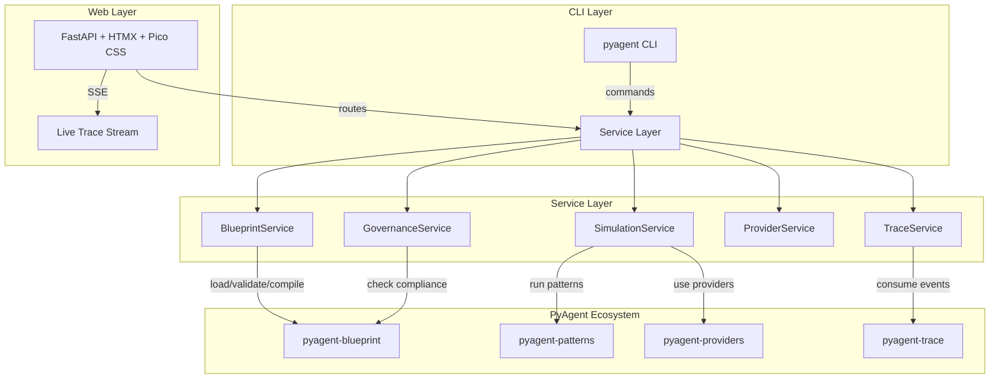

# pyagent-studio

**Pillar 4 of the PyAgent production stack for multi-agent LLM systems** — CLI + web control plane for designing, simulating, debugging, and governing agent systems.

[](../../LICENSE)
[](https://www.python.org/downloads/)

> **Architecture Pillar: 📊 Observability**
> The control plane of the Observability pillar — a `kubectl`-style CLI and FastAPI web dashboard for simulating workflows, exploring recorded traces, diffing blueprint versions, and monitoring provider health and costs.
> Part of the full stack: install `pyagent-all` for all pillars.

## Install

```bash
pip install pyagent-studio
```

Depends on: `pyagent-blueprint`, `pyagent-trace`, `pyagent-providers`, `click`, `rich`, `litellm`, `fastapi`, `uvicorn`, `jinja2`.

## Quick Start

```bash
# Load and validate a blueprint
pyagent apply blueprint.yaml

# List agents
pyagent get agents blueprint.yaml

# Simulate a workflow (MockLLM, no API keys needed)
pyagent simulate blueprint.yaml support "Help me with billing"

# Simulate with real LLMs (set OPENAI_API_KEY, etc.)
pyagent simulate blueprint.yaml support "Help me with billing" --live

# Launch the web dashboard
pyagent dashboard
```

## CLI Commands

| Command | Description |
|---------|-------------|
| `pyagent apply <file>` | Load, validate, and summarize a blueprint |
| `pyagent get <resource> <file>` | List agents, workflows, providers, or contracts |
| `pyagent validate <file>` | Run static validation checks |
| `pyagent test <file>` | Run contract conformance tests |
| `pyagent diff <old> <new>` | Semantic diff between two blueprints |
| `pyagent simulate <file> <wf> <task>` | Run a workflow with MockLLM or `--live` |
| `pyagent render <file>` | Render blueprint as Markdown or `--format mermaid` |
| `pyagent generate` | Scaffold a new blueprint YAML |
| `pyagent providers list` | List available LLM models (via LiteLLM) |
| `pyagent providers health` | Health-check LLM connectivity |
| `pyagent describe <file>` | Print full blueprint summary |
| `pyagent dashboard` | Launch web UI on http://localhost:8501 |

## Web Dashboard

Launch with `pyagent dashboard`. Built with **FastAPI + HTMX + Pico CSS** (zero JS build step).

| Page | URL | Description |
|------|-----|-------------|
| Overview | `/` | Blueprint summary, card grid, validation status |
| Agents | `/agents` | Agent table with prompts, providers, guardrails |
| Workflows | `/workflows` | Workflow table with Mermaid DAG diagrams |
| Simulate | `/simulate` | Run workflows with MockLLM or live LLMs |
| Traces | `/traces` | Live SSE trace stream + historical JSONL viewer |
| Governance | `/governance` | Compliance score, validation issues |
| Providers | `/providers` | LLM model list, health checks |
| Diff | `/diff` | Semantic diff between blueprint versions |
| Docs | `/docs` | Auto-rendered blueprint documentation |

## Provider Setup

pyagent-studio uses [LiteLLM](https://docs.litellm.ai/) for multi-provider LLM access. Set API keys via environment variables:

```bash
export OPENAI_API_KEY=sk-...
export ANTHROPIC_API_KEY=sk-ant-...
export GEMINI_API_KEY=...
```

No custom configuration needed — LiteLLM supports 100+ providers out of the box.

## Services (Headless API)

Use the services layer for scripting and CI:

```python
from pyagent_studio import BlueprintService, SimulationService, GovernanceService, ProviderService

# Load and validate
svc = BlueprintService()
spec = svc.load("blueprint.yaml")
issues = svc.validate()
print(svc.summary())

# Run simulation
import asyncio

sim = SimulationService()
result = asyncio.run(sim.run(spec, "support", "I can't see my invoice"))
print(result.output)

# Governance
gov = GovernanceService()
report = gov.check_compliance(spec)
print(gov.format_report(report))

# Provider health check
provider = ProviderService()
asyncio.run(provider.health_check())
```

## Architecture



Studio is structured in three layers:

- **CLI layer** — Click-based commands (`pyagent apply`, `pyagent simulate`, etc.) for terminal workflows
- **Web layer** — FastAPI + HTMX + Pico CSS dashboard (zero JS build step, all server-rendered)
- **Service layer** — Headless Python services usable from CLI, web, or programmatic scripts

### Web Dashboard Pages in Detail

| Page | URL | What It Shows |
|------|-----|---------------|
| **Overview** | `/` | Blueprint summary cards (agent count, workflow count, provider status), validation status with issue counts, quick-action buttons |
| **Agents** | `/agents` | Table of all agents with their system prompts, assigned providers, guardrails, and token estimates |
| **Workflows** | `/workflows` | Workflow table with auto-generated Mermaid DAG diagrams showing agent connectivity and pattern type |
| **Simulate** | `/simulate` | Run any workflow with MockLLM (no API keys) or `--live` mode with real providers. Streams results in real time |
| **Traces** | `/traces` | Live SSE trace event stream from `TraceEventBus` + historical JSONL trace file browser. Filter by event type, agent, or pattern |
| **Governance** | `/governance` | Compliance score, validation issue list with severity, blueprint diff viewer for version comparison |
| **Providers** | `/providers` | LLM model catalog (via LiteLLM), health check status per provider, capability matrix |
| **Diff** | `/diff` | Side-by-side semantic diff between two blueprint versions with BREAKING/WARNING/INFO annotations |
| **Docs** | `/docs` | Auto-rendered Markdown documentation from the loaded blueprint, including Mermaid diagrams |

### Trace Visualization

The `/traces` page provides two modes of trace inspection:

**Live Mode** — Server-Sent Events (SSE) stream from an active `TraceEventBus`. Events appear in real time as agents execute, showing:
- Agent start/end with input/output previews
- LLM calls with model name, token counts, cost, and latency
- Pattern lifecycle (start → agent calls → end)
- Compression events with savings percentages
- Cost accumulation in real time

**Historical Mode** — Browse JSONL trace files produced by `JsonlExporter` or `Recorder`. Filter and search by:
- Event type (`agent_start`, `llm_call`, `cost`, `compression`, `error`)
- Agent name
- Pattern name
- Time range
- Cost threshold

### Governance & Compliance

The governance page runs `BlueprintValidator` checks and presents:
- **Compliance score** — percentage of checks passing (0–100%)
- **Issue breakdown** — grouped by severity (ERROR, WARNING, INFO)
- **Validation checks** — dangling refs, hardcoded secrets, unrealistic SLAs, unwired observability/context
- **Diff view** — compare current blueprint against a baseline to detect breaking changes

## Services (Headless API) — In Depth

### BlueprintService

Central service for blueprint lifecycle management:

```python
from pyagent_studio import BlueprintService

svc = BlueprintService()
spec = svc.load("blueprint.yaml")  # Load and parse
issues = svc.validate()  # Static analysis
graph = svc.compile()  # Compile to RuntimeGraph
summary = svc.summary()  # Human-readable summary
agents = svc.list_agents()  # Agent inventory
workflows = svc.list_workflows()  # Workflow inventory
mermaid = svc.render_mermaid()  # Mermaid diagram string
```

### SimulationService

Run workflows with MockLLM or live providers:

```python
from pyagent_studio import SimulationService
import asyncio

sim = SimulationService()

# MockLLM simulation (no API keys needed)
result = asyncio.run(sim.run(spec, "support", "I can't see my invoice"))
print(result.output)
print(result.metadata)  # Pattern-specific metadata
print(result.duration_seconds)

# Live simulation with real providers
result = asyncio.run(sim.run(spec, "support", "I can't see my invoice", live=True))
```

### TraceService

Load and query trace data:

```python
from pyagent_studio import TraceService

traces = TraceService()
spans = traces.load("traces/run_001.jsonl")

# Query specific event types
llm_calls = traces.query(event_type="llm_call")
errors = traces.query(event_type="error")

# Cost summary from trace data
print(traces.summary())
# {"total_cost_usd": 0.0189, "total_tokens": 3950, "events": 12}
```

### GovernanceService

Check compliance and generate reports:

```python
from pyagent_studio import GovernanceService

gov = GovernanceService()
report = gov.check_compliance(spec)
print(gov.format_report(report))
# Compliance Score: 85%
# ERRORS (1): dangling agent ref in workflow 'support'
# WARNINGS (2): unwired observability, unrealistic SLA
```

## Integration with PyAgent Ecosystem

Studio integrates with every PyAgent package:

| Package | Integration Point |
|---------|------------------|
| **pyagent-blueprint** | Load, validate, compile, diff, render, test blueprints |
| **pyagent-patterns** | Execute workflows using compiled pattern instances |
| **pyagent-providers** | List available LLM models, health-check connectivity, use for live simulation |
| **pyagent-trace** | Subscribe to `TraceEventBus` for live trace streaming; load JSONL for historical analysis |
| **pyagent-context** | Display context configuration from blueprint; visualize memory tier usage |
| **pyagent-compress** | Show compression savings in trace viewer; display token budget utilization |
| **pyagent-router** | Display routing decisions and model selection in trace viewer |

## Comparison

| Feature | pyagent-studio | Langflow | CrewAI Studio | LangSmith |
|---------|---------------|----------|---------------|-----------|
| Declarative YAML blueprints | ✓ | ✗ (visual) | ✗ (Python) | ✗ |
| CLI control plane | ✓ | ✗ | ✗ | ✗ |
| Semantic diff / governance | ✓ | ✗ | ✗ | ✗ |
| MockLLM simulation | ✓ | ✗ | ✗ | ✗ |
| Multi-provider (100+) | ✓ (LiteLLM) | Limited | Limited | N/A |
| Portal-agnostic tracing | ✓ | ✗ | ✗ | Proprietary |
| Zero JS build step | ✓ (HTMX) | ✗ (React) | ✗ (React) | ✗ (React) |
| Live trace streaming (SSE) | ✓ | ✗ | ✗ | ✗ |
| Governance & compliance | ✓ | ✗ | ✗ | ✗ |

## Other packages in this pillar

- `pyagent-trace` — TraceEventBus, OTel spans, cost tracking, record/replay

## Full stack

Install all pillars at once: `pip install pyagent-all`

→ [pyagent.org](https://pyagent.org) for full documentation.

## Full Documentation

See [pyagent.org](https://pyagent.org) for full API reference and integration guides.

<!-- pyagent-ecosystem-footer:start -->

## The PyAgent ecosystem

PyAgent is a production stack for multi-agent LLM systems. Each package is independent — install
only what you need, or get everything with [`pip install pyagent-all`](https://pyagent.org/getting-started/).

| Package | What it gives you |
|---------|-------------------|
| `pyagent-blueprint` | [Declarative multi-agent blueprints](https://pyagent.org/guides/blueprint/) — compile, validate, and diff agent systems from YAML |
| `pyagent-patterns` | [Reusable multi-agent design patterns](https://pyagent.org/packages/patterns/) — Supervisor, Pipeline, ReAct, and 15 more |
| `pyagent-router` | [Difficulty-aware model routing](https://pyagent.org/guides/router/) — cost-efficient model selection per task |
| `pyagent-compress` | [Token-efficient agent compression](https://pyagent.org/guides/compression/) — inter-agent token budgets |
| `pyagent-providers` | [Multi-provider orchestration](https://pyagent.org/guides/providers/) — fallback chains and capability negotiation |
| `pyagent-context` | [Stateful agent memory](https://pyagent.org/guides/context/) — trust-aware, three-tier context ledger |
| `pyagent-trace` | [Multi-agent observability & tracing](https://pyagent.org/guides/tracing/) — pattern-aware OpenTelemetry spans |
| `pyagent-studio` | [Agent control plane dashboard](https://pyagent.org/guides/studio/) — live traces, cost, and governance |

**Learn more:**
[Design patterns](https://pyagent.org/packages/patterns/) ·
[Cookbook](https://pyagent.org/cookbook/) ·
[Get started](https://pyagent.org/getting-started/)

<!-- pyagent-ecosystem-footer:end -->
